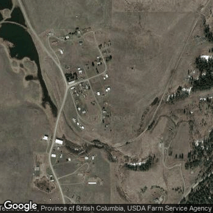
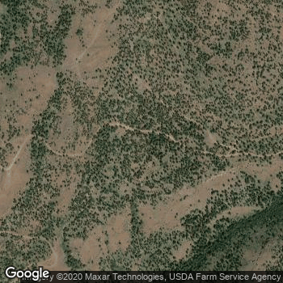
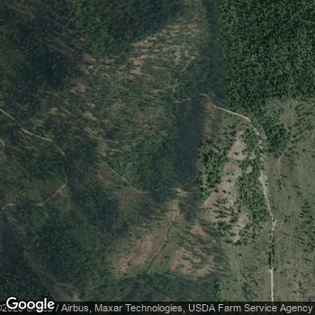
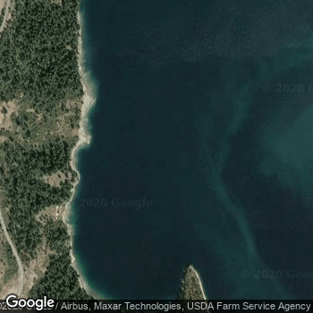
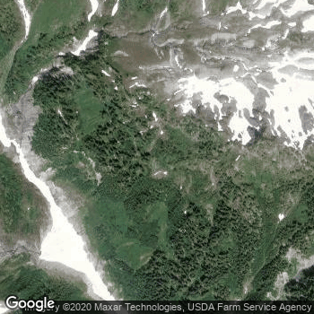
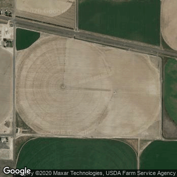

# Wildfire Prevention with Satellite Image Analysis

Note: This is a work in progress, please check back soon!

-TB

--------------------------------------------------------------------------------
Washington State experiences thousands of wildfires every year. My goal for this project is to plant the seed for a product or service that can scan through satellite data in order to identify areas at risk for wildfires. While I start this project with a focus on Washington State, it can easily be expanded to data from the entire world. The users of this product would likely be state governments interested in being able to prevent wildfires in their state.

This repository contains data collection, exploratory data analysis, and a convolutional neural network model used to predict whether or not a location is susceptible to wildfires. There is also a notebook previewing implementation of the neural network for real world applications.  The data for this exploration consists of roughly 20,000 labeled satellite images. 10,000 of the images are locations which have experienced wildfires, while the other 10,000 have never seen a wildfire before.

For this project, I used the Google Maps API to collect satellite imagery for roughly 12,000 locations that have seen wildfires in the past 12 years. For each latitude and longitude set (sourced from the Washington State DNR [here](https://data-wadnr.opendata.arcgis.com/datasets/dnr-fire-statistics-2008-present-1/data)), I plugged the location data into the Maps API to pull an image. For the non-wildfire images, I simply used a randomly generated set of 10,000 longitude and latitude pairs existing in Washington. This is how I sourced my labeled data for this project. Examples below:

__Areas with wildfires:__

__Areas without wildfires:__

While I was unable to collect satellite imagery of the site a few days before the fire, I believe this will suffice as a proof of concept, especially since areas that experience wildfires often experience them again.

# Exploratory Data Analysis

Before diving into the neural network, here's a glimpse at the state of wildfires in Washington.  This first map shows a sample of wildfires by size.  Yellow points to smaller wildfires, orange means medium sized, and red circles are the largest wildfires.

As you can see, many of the largest wildfires take place in central Washington, while the smaller and medium sized wildfires are scattered around the state more evenly.

This next map shows wildfires by cause.  Yellow means lightening, blue means debris, and red means arson.

It's interesting to see where the clusters of arson are.  This is another insight police and fire departments can use to prevent fires in their areas.

# Neural Network

For this project, I chose to use a convolutional neural network.  It's the industry standard for image recognition as it is able to pick up patterns and distinguish different images from each other.  

The model is currently a WIP.

# Further Work

In the future, there are several things I would like to try:
- Satellite imagery of wildfire locations a day before the fire started.  This would make my training data quite a bit more accurate, as it would train the model to recognize locations right before they went up in flames.
- A web app or service that scans through satellite databases in real time to warn fire departments of risky areas.  With my current resources, this is not quite feasible in terms of API costs or computational power.

# Conclusion

There's a ways to go before this project is fully fleshed out and deployable, but I believe it's a great start for a different take on wildfire prevention.  Hopefully in the future, this project can be fully deployed and used by fire deparments around the world.  As I gain more expertise in handling image recognition tasks and collecting satellite imagery from more complex and thorough sources (e.g. NASA), I can't wait to come back to this project and develop the neural network to make it more and more accurate!

Thanks for reading, and please let me know if you have any questions or comments!

-Thomas Brown